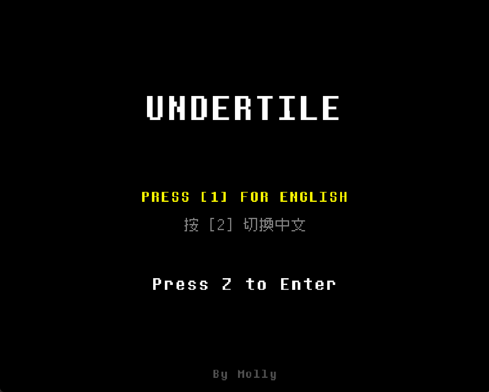
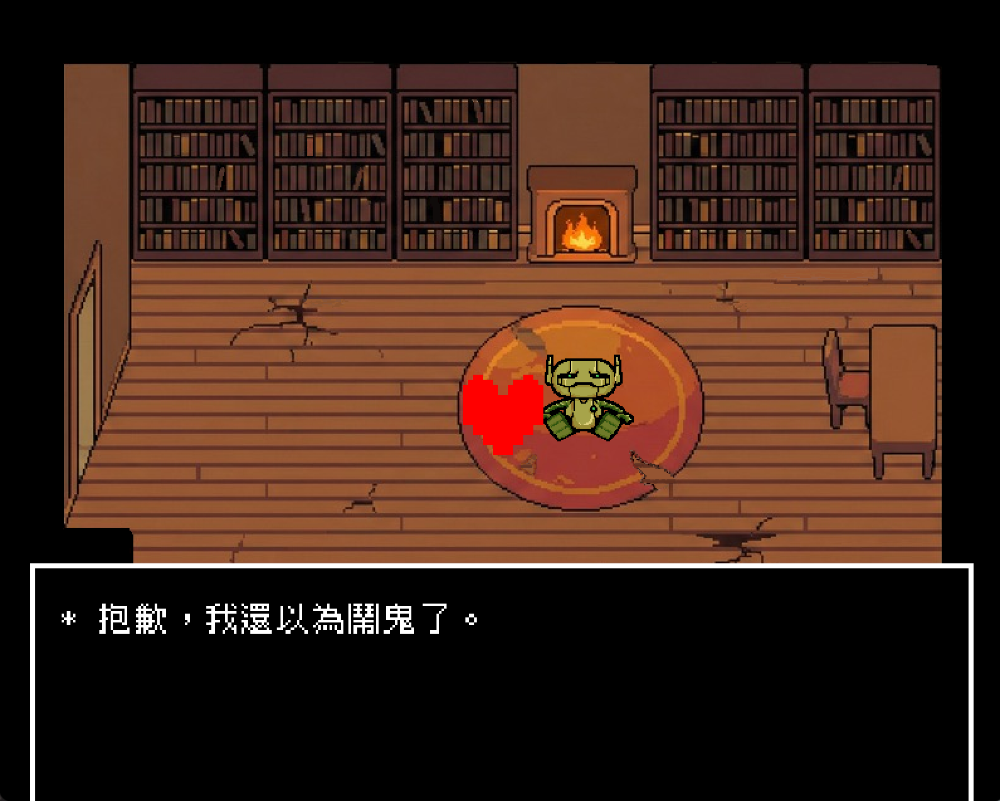
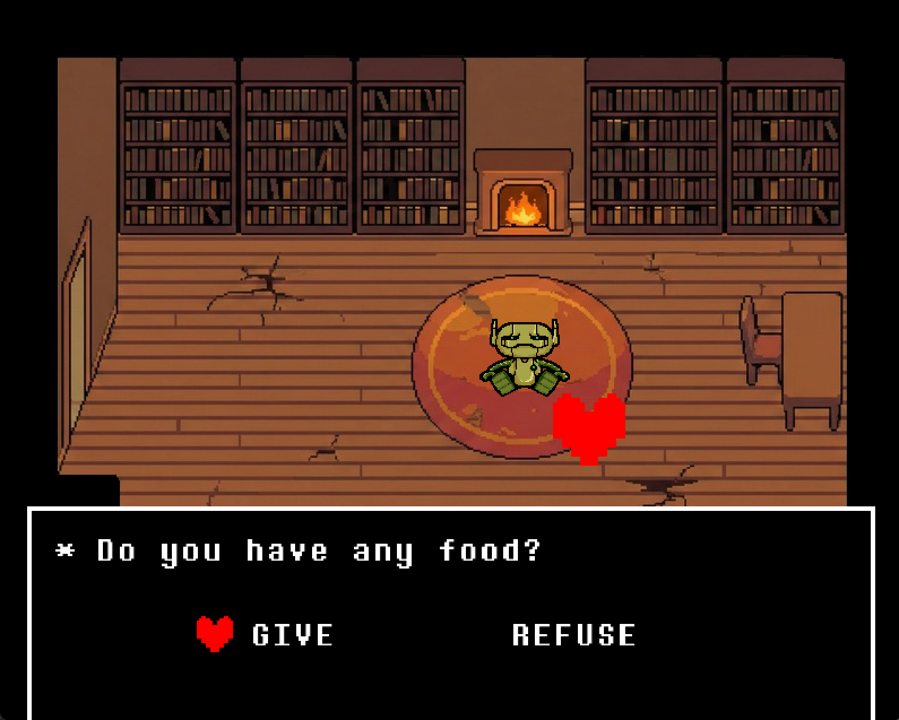
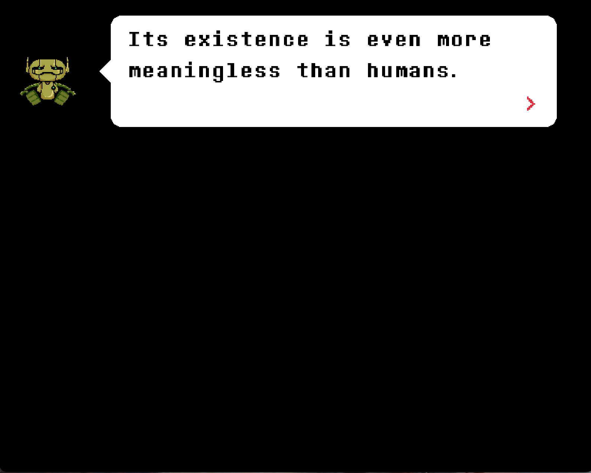
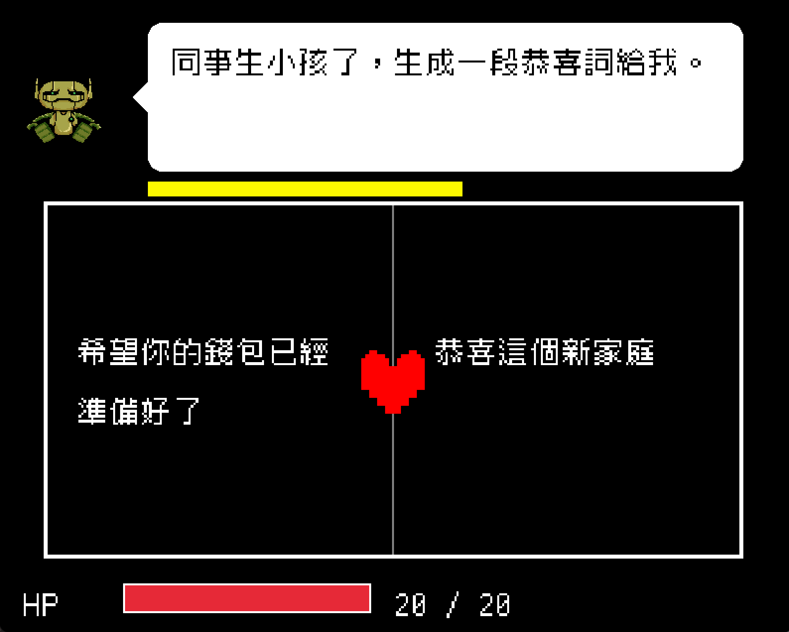

# Undertile
<small><em>A fan-made recreation inspired by Undertale by Toby Fox</em></small>

| | | 
|:-------------------------:|:-------------------------:|
|  對話（中文） |  food(EN)|
| prebattle(EN) |   戰鬥（中文）|

## Overview
This project is available in **two versions** with slightly different content due to hardware constraints:
1.  PC Version: Runs on **Windows/macOS**.
2.  ESP32 Version: Runs on custom electronics.

This project supports **two languages**:
1. English
2. 繁體中文

The overall gameplay will be **~3mins**.

---

## PC Version
Built using C++ and [Raylib](https://www.raylib.com/).

### Controls
| Action | Key | 
| :--- | :---: | 
| **Move** | Arrow Keys | 
| **Interact / Confirm** | Z | 
| **Cancel** | X | 

### Downloads & Source
* **Windows:** Source code in [`main/PC`](https://github.com/FeitingRen/Undertile/tree/main/PC/). Download executable in [Releases](https://github.com/FeitingRen/Undertile/releases/tag/v1.0).
* **macOS:** Source code in [`mac/PC`](https://github.com/FeitingRen/Undertile/tree/mac/PC/src). Download executable in [Releases](https://github.com/FeitingRen/Undertile/releases/tag/v1.0).

### How to Build and run on local
1.  Install a C++ Compiler (Visual Studio, MinGW, or Clang).
2.  Configure CMake with the CMakeLists.txt.
3.  If you are using VSCode,build and run the project by clicking the buttons at bottom left. 

---

## ESP-32 Electronic Device Version

To run this version, you must assemble the hardware and upload the firmware using the Arduino IDE.

### 1. Hardware 
* ESP-32 Dev Module
* MicroSD Card Module + SD Card (>5MB)
* MAX98357 I2S Amplifier Module + 3W 8R Speaker
* ST7735 IPS 1.8" TFT Display (128x160)
* 4x4 Matrix Keypad Module
* Breadboards, Jumper Wires

### 2. Wiring 

#### **Display (ST7735)**
| Pin | ESP32 Pin |
| :--- | :--- |
| VCC | 3.3V |
| GND | GND |
| CS | GPIO 5 |
| RESET | GPIO 4 |
| A0 / DC | GPIO 2 |
| SDA / MOSI | GPIO 23 |
| SCK / SCL | GPIO 18 |
| LED | 3.3V |

#### **Audio (MAX98357A)**
| Pin | ESP32 Pin |
| :--- | :--- |
| VIN | 3.3V / 5V |
| GND | GND |
| BCLK | GPIO 26 |
| LRC | GPIO 25 |
| DIN | GPIO 22 |

#### **Storage (MicroSD Module)**
| Pin | ESP32 Pin |
| :--- | :--- |
| VCC | 5V |
| GND | GND |
| MISO | GPIO 19 |
| MOSI | GPIO 23 |
| SCK | GPIO 18 |
| CS | GPIO 21 |

#### **Input (4x4 Keypad)**
| Keypad Pin | ESP32 Pin | Function |
| :--- | :--- | :--- |
| PIN 2 | GPIO 13 | Row 1 |
| PIN 3 | GPIO 14 | Row 2 |
| PIN 4 | GPIO 27 | Row 3 |
| PIN 7 | GPIO 32 | Col 1 |
| PIN 8 | GPIO 33 | Col 2 |

**Keypad Mapping:**
* **S11:** UP
* **S12:** DOWN
* **S16:** LEFT
* **S8:** RIGHT
* **S15:** CONFIRM / ENTER

### 3. Software Setup
1.  Format your MicroSD card to FAT32.
2.  Copy the contents of the `assets` folder to the root of the SD card.
3.  Open the `.ino` file in **Arduino IDE**.
4.  Install required libraries (via Library Manager):
    * `TFT_eSPI` (Configure `User_Setup.h` for ST7735)
    * `Keypad`
    * `ESP32-audioI2S`
5.  Upload to your ESP32.
